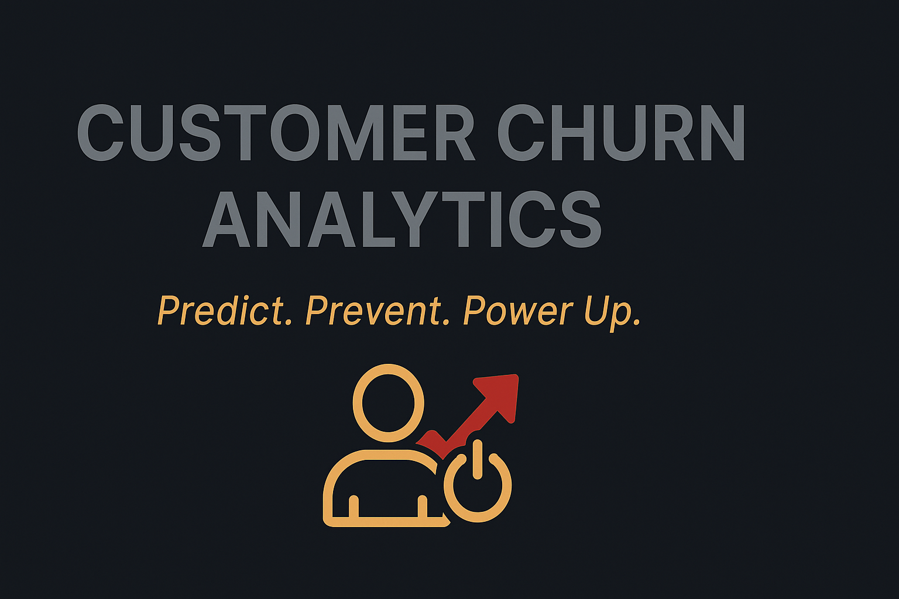

<p align="center">
  
</p>


# 📊 Customer Churn Analytics

> **Predict, Prevent, and Power Up Business Retention.**

Welcome to **Customer Churn Analytics**, your smart gateway to understanding why customers leave and how to stop them in real time!  
This end-to-end industry-grade project uses real-world data, advanced Machine Learning, live API simulations, PostgreSQL integration, explainable AI (SHAP), and an elegant Streamlit web app. 🚀

🔎 Whether you're analyzing customer loyalty or fine-tuning retention strategies, this project gives you the full data power you need.

---


## Project Highlights:

- *Real-world dataset* used (no toy examples or dummy numbers).
- *End-to-end system* from model training to live deployment.
- *Live API simulation* to mimic real customer inputs.
- *Database Integration* using *PostgreSQL* — every prediction is securely stored.
- *Explainable AI* with *SHAP* — understand the "why" behind each prediction.
- *Streamlit App* for simple, intuitive user interaction.
- *Industry-Ready* — clean code, scalable architecture, deployment-friendly.

---

## Project Structure:
Customer-Churn-Analytics/
├── models/
│   ├── model.pkl
│   └── scaler.pkl
├── utils/
│   ├── utils.py
│   └── db_config.py
├── api/
│   └── api_simulation.py
├── shap/
│   └── shap_explain.py
├── model_training.ipynb
├── app.py
├── requirements.txt
└── README.md
---

## Tech Stack:

- *Python* (Streamlit, Scikit-learn, Pandas, SHAP)
- *PostgreSQL* (Database storage)
- *Heroku / AWS / Azure* (Deployment-ready)
- *APIs* (Live simulation of user data)

---

## How to Run Locally:

1. *Clone the repo*  
```bash
git clone https://github.com/your-username/Customer-Churn-Analytics.git
cd Customer-Churn-Analytics

2.	Create a virtual environment

python -m venv venv
source venv/bin/activate  # On Windows use: venv\Scripts\activate

3.	Install all requirements

pip install -r requirements.txt

4.	Start the Streamlit app

streamlit run app.py

Why This Project Stands Out:

“It doesn’t just predict churn — it explains it, stores it, and simulates it.”

This is not just a machine learning model; it’s a full customer intelligence system. Built to impress recruiters, managers, clients — and your future self.

Sneak Peek:

Imagine knowing why a customer would leave, before they even think about it.
That’s the magic we’re bottling here.

License:

This project is open-source under the MIT License.

⸻

Connect with Me:

If you liked this, feel free to connect on LinkedIn or drop a ⭐ on the repo!

